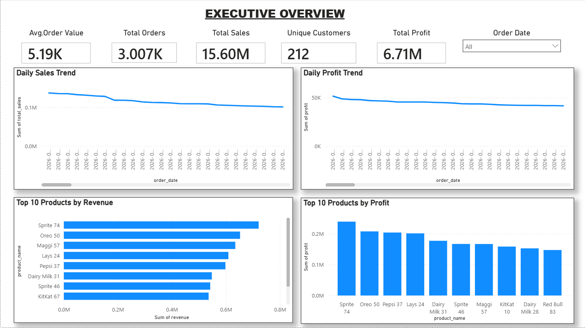
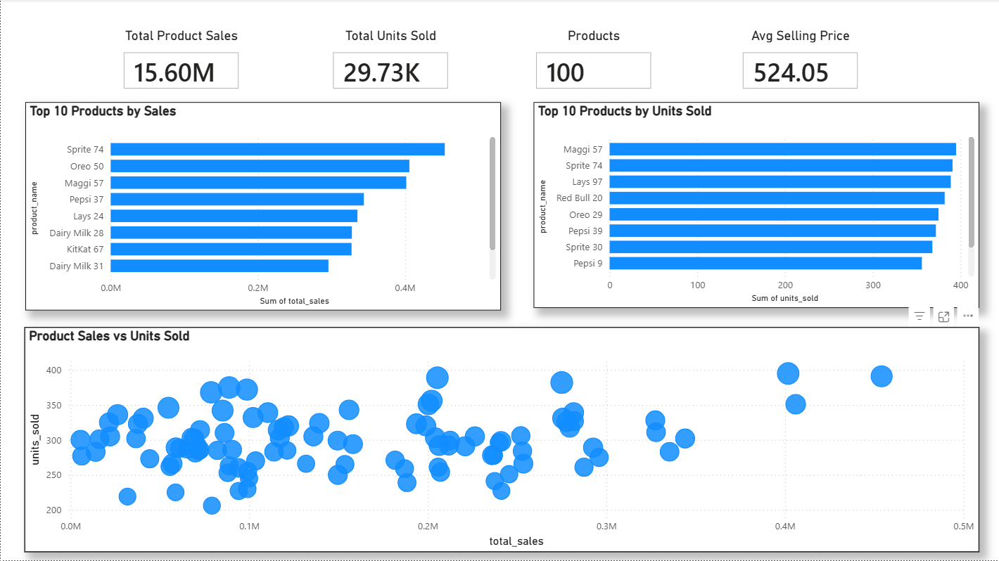
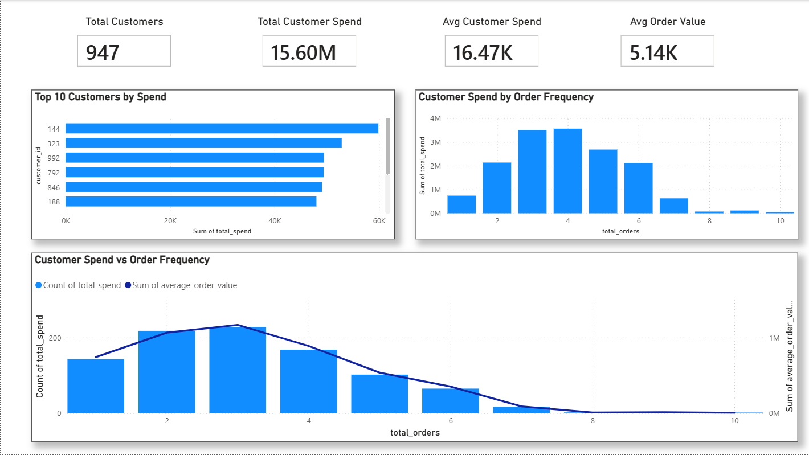
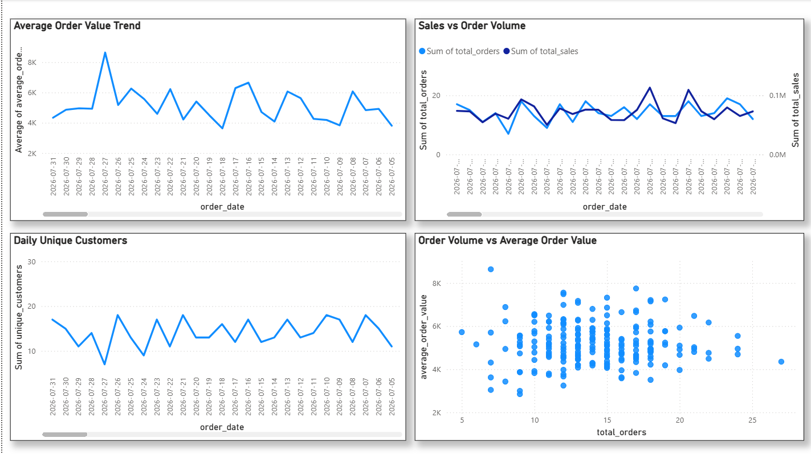

# Retail Intelligence & Demand Forecasting Platform


A production-style retail analytics platform that automates data ingestion, transformation, validation, orchestration, and business intelligence reporting using Python, PostgreSQL, dbt, Apache Airflow, and Power BI.


## 📌 Project Overview


This project demonstrates an end-to-end modern data analytics pipeline for transforming raw retail transaction data into reliable, business-ready analytics.


The platform processes retail orders, customers, and product data through an automated ETL and transformation workflow before delivering interactive Power BI dashboards for sales, product, customer, and performance analysis.


## 🎯 Business Problem


Retail businesses generate large volumes of transactional data, but raw data alone does not provide actionable business insight.


This platform addresses the need to:


- Centralize retail transaction data
- Automate data extraction and transformation
- Create reliable analytical datasets
- Monitor sales and profitability
- Identify high-performing products
- Understand customer purchasing behaviour
- Provide decision-makers with interactive dashboards


## 🏗️ Data Architecture


```text
                Raw Retail Data
                      │
                      ▼
              ┌───────────────┐
              │   Python ETL  │
              │ Data Cleaning │
              │ Transformation│
              └───────┬───────┘
                      │
                      ▼
              ┌───────────────┐
              │  PostgreSQL   │
              │   Database    │
              └───────┬───────┘
                      │
                      ▼
              ┌───────────────┐
              │      dbt      │
              │   Staging     │
              │      ↓        │
              │     Marts     │
              └───────┬───────┘
                      │
                      ▼
              ┌───────────────┐
              │ Apache Airflow│
              │ Orchestration │
              └───────┬───────┘
                      │
                      ▼
              ┌───────────────┐
              │   Power BI    │
              │   Dashboards  │
              └───────────────┘
🛠️ Technology Stack
Technology	Purpose
Python	ETL and data processing
PostgreSQL	Relational data warehouse/database
dbt	Data transformation and analytical modelling
Apache Airflow	Pipeline orchestration
Power BI	Business intelligence and visualization
Docker	Containerized Airflow environment
Git & GitHub	Version control and project management
🔄 Data Pipeline

The pipeline follows an automated multi-stage workflow:

1. Data Ingestion & ETL

Python is used to process the raw retail data and prepare it for database loading.

The ETL process handles:

Data extraction
Data cleaning
Data type handling
Transformation
Database loading

Main ETL script:

python/etls/retail_etl.py
2. PostgreSQL

Cleaned data is loaded into PostgreSQL where it becomes the foundation for the analytical layer.

The database contains retail entities including:

Customers
Products
Orders
Order items
3. dbt Transformation Layer

dbt is used to transform raw database tables into structured analytical models.

Staging Models
stg_customers
stg_orders
stg_products

These models provide a clean and standardized representation of the source data.

Analytical Marts
fct_sales
mart_sales_daily
mart_product_performance
mart_customer_performance

These marts are designed specifically for business analysis and Power BI reporting.

4. Data Quality & Testing

dbt tests and schema definitions are used to validate the analytical models.

Validation includes checks for:

Required fields
Unique identifiers
Referential relationships
Data consistency
5. Apache Airflow

Apache Airflow orchestrates the end-to-end pipeline.

The pipeline follows:

Python ETL
    ↓
dbt Run
    ↓
dbt Test

The Airflow DAG is located at:

airflow/dags/retail_pipeline.py

The pipeline is containerized using Docker Compose.

6. Power BI

Power BI connects to the analytical data layer and provides interactive reporting.

The dashboard contains four main analytical areas:

Executive Overview

Provides high-level business KPIs including:

Total Sales
Total Profit
Total Orders
Unique Customers
Average Order Value

Also includes sales and profit trends and top-performing products.

Product Performance

Provides analysis of:

Product sales
Units sold
Order volume
Average selling price
Top-performing products
Customer Performance

Provides analysis of:

Customer count
Customer spend
Average customer spend
Average order value
Customer order frequency
Sales Analysis

Provides analysis of:

Average order value trends
Sales versus order volume
Daily unique customers
Order volume and average order value
## 📊 Power BI Dashboard

### Executive Overview



### Product Performance



### Customer Performance



### Sales Analysis


📊 Key Results

The final analytical model currently produces:

Metric	Result
Total Sales	15.60M
Total Profit	6.71M
Total Orders	~3K
Unique Customers	947
Products	100
Units Sold	29.73K
Average Order Value	~5.19K

These values are surfaced through the Power BI analytical layer.

📁 Project Structure
retail-intelligence-demand-forecasting-platform/
│
├── airflow/
│   ├── config/
│   ├── dags/
│   │   └── retail_pipeline.py
│   ├── Dockerfile
│   └── docker-compose.yaml
│
├── dbt/
│   └── retail_analytics/
│       ├── dbt_project.yml
│       ├── models/
│       │   ├── staging/
│       │   │   ├── stg_customers.sql
│       │   │   ├── stg_orders.sql
│       │   │   └── stg_products.sql
│       │   │
│       │   └── marts/
│       │       ├── fct_sales.sql
│       │       ├── mart_sales_daily.sql
│       │       ├── mart_product_performance.sql
│       │       └── mart_customer_performance.sql
│       │
│       ├── tests/
│       └── README.md
│
├── python/
│   └── etls/
│       └── retail_etl.py
│
├── dashboard/
├── database/
├── docs/
├── notebooks/
├── screenshots/
├── tests/
│
├── .gitignore
├── LICENSE
└── README.md
🚀 How to Run
Prerequisites

Install or configure:

Docker Desktop
PostgreSQL
Python
Git
dbt Core with PostgreSQL adapter
Power BI Desktop
Start Airflow

Navigate to the Airflow directory:

cd airflow

Start the Docker services:

docker compose up -d
Run the Airflow Pipeline

The Airflow DAG is:

retail_intelligence_pipeline

The workflow executes:

run_python_etl
        ↓
run_dbt
        ↓
test_dbt
Run dbt Manually

Navigate to:

cd dbt/retail_analytics

Run:

dbt run

Then execute:

dbt test

Database credentials and environment-specific configuration should be stored locally and must not be committed to GitHub.

🔍 Data Quality & Validation

The project includes validation at multiple stages:

ETL Validation

Python handles initial data preparation and loading.

dbt Validation

dbt models are tested using schema-based data quality checks.

Pipeline Validation

Airflow provides orchestration and task-level monitoring.

Business Validation

Key metrics were cross-checked between the analytical models and Power BI to ensure consistent reporting.

💡 Business Insights

The platform enables stakeholders to investigate:

Overall sales and profitability performance
Daily sales and profit trends
High-performing products
Product sales and unit volume relationships
Customer spending behaviour
Customer order frequency
Order volume versus average order value
🔮 Future Enhancements

Potential extensions include:

Demand forecasting using machine learning
Inventory optimization
Automated anomaly detection
Product-level demand prediction
Customer segmentation
Automated business alerts
Cloud deployment
CI/CD for dbt
Advanced pipeline monitoring
Automated Power BI refresh workflows
👨‍💻 Author

Midhun K A

Data Analytics | Python | SQL | Power BI | dbt | PostgreSQL | Apache Airflow

⭐ This project demonstrates an end-to-end approach to building a production-style retail analytics pipeline, from raw data ingestion through transformation, orchestration, validation, and business intelligence.


### One important thing


I deliberately called the project **"Retail Intelligence & Demand Forecasting Platform"**, but I have **not claimed that demand forecasting/ML is already implemented**. Your current verified implementation is an analytics platform with forecasting listed as a future enhancement.


That's much better for interviews—you can confidently explain **what you actually built** without a recruiter discovering that "forecasting" isn't currently in the pipeline.


### Now save it


In VS Code:


**Ctrl + A → paste the README above → Ctrl + S**


Then run:


```powershell
git status